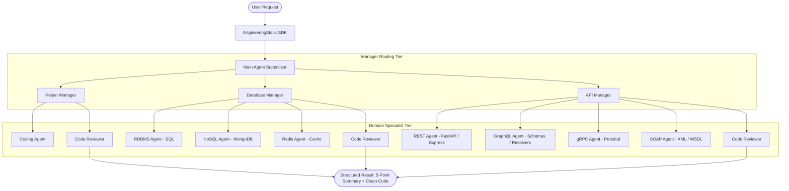

# 🛠️ EngineeringStack SDK

[](https://test.pypi.org/project/engineeringstack/)
[](https://www.python.org/)
[](https://github.com/langchain-ai/langgraph)
[](tests/)
[](LICENSE)

**EngineeringStack** is a hierarchical multi-agent engineering framework built on top of LangGraph.

Instead of relying on a single prompt to handle database modeling, API architecture, algorithm implementation, and code quality all at once, EngineeringStack organizes specialized agents into a structured engineering team. A top-level supervisor delegates tasks to dedicated domain managers, who coordinate specialized leaf agents and enforce a code review quality gate before returning results.

---

## 🎯 What EngineeringStack Does

EngineeringStack coordinates a 3-tier hierarchy of AI agents designed to handle full-lifecycle software development tasks:



### Agent Hierarchy & Roles

| Tier | Agent | Responsibility |
| :--- | :--- | :--- |
| **Supervisor** | **Main Agent** | Classifies incoming intent, handles general discussions directly, and routes engineering tasks to the appropriate manager. |
| **Manager** | **Helper Manager** | Handles standalone single-file tasks, scripts, algorithms, utilities, and bug fixes. Coordinates `Coding_Agent`. |
| ↳ *Specialist* | `Coding_Agent` | Generates general software logic, scripts, algorithms, and bug fixes. |
| **Manager** | **Database Manager** | Coordinates database architecture across relational, document, and in-memory caching systems. |
| ↳ *Specialist* | `RDBMS_agent` | Relational database schemas (PostgreSQL, MySQL, SQLite), migrations, tables, indexes, and queries. |
| ↳ *Specialist* | `NoSQL_agent` | Document stores (MongoDB, DynamoDB), schemas, collections, indexes, and aggregation pipelines. |
| ↳ *Specialist* | `REDIS_agent` | In-memory key-value caching, session storage, pub/sub configurations, and rate-limiting scripts. |
| **Manager** | **API Manager** | Coordinates API design and service communication across modern and enterprise protocols. |
| ↳ *Specialist* | `REST_Agent` | RESTful endpoints (FastAPI, Flask, Express), HTTP handlers, request validation, and status codes. |
| ↳ *Specialist* | `GraphQL_Agent` | GraphQL schema definitions (`.graphql`), queries, mutations, subscriptions, and resolvers. |
| ↳ *Specialist* | `GRPC_Agent` | Protocol Buffer contracts (`.proto`), gRPC server interfaces, and client stubs. |
| ↳ *Specialist* | `SOAP_Agent` | Enterprise XML schemas, WSDL contracts, and SOAP payload handlers. |
| **Quality Gate** | **Code Reviewer** | Audits all generated code for correctness, security, and best practices. Delivers a structured 5-bullet summary alongside clean code. |

---

## 📦 Installation & Setup

```bash
# Using uv (recommended)
uv add engineeringstack --index-url https://test.pypi.org/simple/

# Or using pip
pip install --index-url https://test.pypi.org/simple/ --extra-index-url https://pypi.org/simple engineeringstack
```

Set your model provider API key (e.g. Groq, OpenAI, Anthropic, Gemini):

```bash
export GROQ_API_KEY="gsk_..."
# or
export OPENAI_API_KEY="sk-..."
```

---

## 🧠 Memory Systems

EngineeringStack provides two distinct memory mechanisms: **Session Memory** for active multi-turn conversations, and **Persistent Memory** for long-term project guidelines, preferences, and agent instructions.

### 1. Session Memory (Multi-Turn Conversations)

Session memory maintains conversation history and context within a thread. By passing a `thread_id`, the agent remembers requirements, earlier decisions, and prior code generated during earlier turns.

> [!tip]
> Use a unique `thread_id` per user session, task, or feature workflow to maintain state across multiple calls.

```python
from engineeringstack import create_engineering_stack

stack = create_engineering_stack()

# Turn 1: Introduce project context
stack.invoke(
    "We are building a payment gateway called PayNexus using FastAPI and PostgreSQL.",
    thread_id="session-paynexus-01"
)

# Turn 2: Follow-up request relying on context from Turn 1
response = stack.invoke(
    "Generate the database schema for transaction records.",
    thread_id="session-paynexus-01"
)

print(response.code)
# Output includes PostgreSQL tables specifically tailored to PayNexus transactions.
```

### 2. Persistent Memory & Stores

Persistent memory stores long-term instructions, coding guidelines, and project specifications in `/memories/` files (such as `preferences.md` and `AGENTS.md`). Agents can read from and write to these memory files across different sessions.

Memories are managed via LangGraph stores (defaults to `InMemoryStore`, or custom stores like `PostgresStore` for persistent databases):

```python
from langgraph.store.memory import InMemoryStore
from engineeringstack import create_engineering_stack

custom_store = InMemoryStore()

stack = create_engineering_stack(
    memory=["/memories/preferences.md", "/memories/coding_standards.md"],
    store=custom_store,
)

# Any memory updates (e.g., project coding rules) are saved to the store
response = stack.invoke("Remember that all database timestamps must use UTC timezone.")
```

> [!note]
> **Procedural Skills (`/skills/`)**: Procedural routing skills (e.g., `main-agent`, `helper-manager`, `database-manager`, `api-manager`, `code-review`) are developer-controlled, immutable, and strictly loaded from the SDK's internal package directory.

---

## 🔌 Bring Your Own Model (BYOM)

EngineeringStack is model-agnostic. You can use any major LLM provider by passing a model string or a pre-configured LangChain `BaseChatModel` instance.

> [!note]
> The default model is `"ollama:qwen3-coder:30b"`. You can switch providers instantly with a single parameter.

### Using Provider Strings

```python
from engineeringstack import create_engineering_stack

# 1. Groq (High-speed inference)
stack = create_engineering_stack(model="groq:llama-3.3-70b-versatile")

# 2. Local Ollama (Private & offline)
stack = create_engineering_stack(model="ollama:qwen2.5-coder:7b")

# 3. OpenAI
stack = create_engineering_stack(model="openai:gpt-4o")

# 4. Google Gemini
stack = create_engineering_stack(model="gemini:gemini-2.0-flash")

# 5. Anthropic Claude
stack = create_engineering_stack(model="anthropic:claude-3-5-sonnet-20241022")
```

### Using Custom LangChain ChatModel Instances

If you need custom credentials, proxy settings, or specific hyperparameters (e.g., `temperature`, `timeout`), pass the initialized chat model directly:

```python
from langchain_openai import ChatOpenAI
from langchain_groq import ChatGroq
from engineeringstack import create_engineering_stack

# Custom OpenAI model with low temperature
custom_model = ChatOpenAI(
    model="gpt-4o-mini",
    temperature=0.1,
    max_tokens=4096
)

stack = create_engineering_stack(model=custom_model)
```

---

## ⚡ Execution Modes

EngineeringStack supports synchronous invocation, streaming, asynchronous streaming, and batch execution:

### 1. Synchronous Invocation (`invoke`)

```python
from engineeringstack import create_engineering_stack

stack = create_engineering_stack()

result = stack.invoke("Create a Redis token-bucket rate limiter in Python.")

# Structured 5-point executive summary
print("--- SUMMARY ---")
for point in result.summary:
    print(f"- {point}")

# Clean executable code
print("\n--- CODE ---")
print(result.code)
```

### 2. Streaming (`stream`)

Stream text chunks in real-time for terminal applications or interactive UIs:

```python
for chunk in stack.stream("Write a Python decorator for caching function results."):
    print(chunk, end="", flush=True)
```

### 3. Asynchronous Streaming (`astream`)

Ideal for integration into async frameworks such as FastAPI, WebSockets, or async workers:

```python
import asyncio
from engineeringstack import create_engineering_stack

async def main():
    stack = create_engineering_stack()
    async for chunk in stack.astream("Design a REST API endpoint for user registration."):
        print(chunk, end="", flush=True)

asyncio.run(main())
```

### 4. Batch Processing (`batch`)

Process multiple development tasks concurrently:

```python
tasks = [
    "Write a SQL migration adding an index to the orders table.",
    "Create a FastAPI route to fetch an order by ID.",
    "Build a Redis helper to cache order details."
]

results = stack.batch(tasks)

for task_name, res in zip(tasks, results):
    print(f"Task: {task_name}")
    print(f"Summary points: {len(res.summary)} | Code lines: {len(res.code.splitlines())}\n")
```

---

## 📋 Structured Output (`AIOutput`)

Every call returns a typed `AIOutput` object:

```python
class AIOutput:
    summary: list[str]  # 5 concise bullet points summarizing the implementation
    code: str           # Pure, executable code extracted from the solution
    text: str           # Full raw response text including explanations
```

---

## 🎛️ Logging & Diagnostics

EngineeringStack is silent by default, using `logging.NullHandler` to avoid unprompted stdout logging in production applications.

> [!important]
> To inspect internal agent routing, subagent calls, or debugging messages, enable logging explicitly:

```python
from engineeringstack import enable_logging, disable_logging

# Enable verbose console logging
enable_logging(to_console=True)

# Run queries with full routing visibility...
stack.invoke("Design a MongoDB collection for audit logs.")

# Disable logging when done
disable_logging()
```

You can also enable debug logging via environment variables:

```bash
export ENGINEERINGSTACK_DEBUG=1
# or
export ENGINEERINGSTACK_LOG_LEVEL=DEBUG
```

---

## 🧪 Testing

The codebase includes a comprehensive test suite covering agent routing, memory persistence, schema normalization, and tool execution:

```bash
uv run pytest
```

```text
============================= 135 passed in 29.12s =============================
```

---

## 📄 License

Distributed under the **MIT License**. See [LICENSE](LICENSE) for details.
