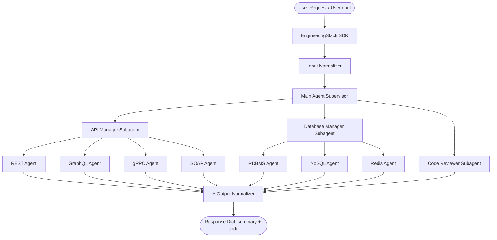

# EngineeringStack SDK 🛠️🚀

[](https://github.com/BenjaminVijayaraj5102004/Engineering_Stack)
[](https://www.python.org/)
[](https://github.com/langchain-ai/langgraph)
[](LICENSE)

**`engineeringstack`** is an enterprise-grade, hierarchical multi-agent engineering SDK built on **LangGraph** and **DeepAgents**. It orchestrates specialized AI subagents for full-stack software development, API design, database architecture, and code review with custom LLM support and structured input/output normalization.

---

## 🌟 What's New in v0.1.2

- **Dynamic Custom Model Integration**: Plug in any LangChain `BaseChatModel` or string model identifier (Groq, Google Gemini, Ollama, OpenAI, Anthropic) seamlessly into the stack.
- **Structured Schema Normalization**: Automatic transformation of raw strings or dicts into typed `UserInput` and `AIOutput` (with formatted summaries and code extractions).
- **Hierarchical Agent Graph**: Re-architected multi-agent delegation with specialized Manager subagents (`API Manager`, `Database Manager`) and domain worker subagents.
- **Streamlined SDK Surface**: Clean encapsulation exporting `EngineeringStack` and `create_engineering_stack` with async, streaming, and batch capabilities.
- **Comprehensive Logging & Privacy**: Built-in structured logging with full isolation of secrets, log traces, and cache artifacts from git version control.

---

## 📊 Available Agents & Feature Matrix

The following table provides a complete breakdown of all available features, agent capabilities, protocol implementations, and SDK methods in **EngineeringStack v0.1.2**:

| Feature Category | Capability / Component | Available Status | Description & Capabilities |
| :--- | :--- | :---: | :--- |
| **Core Architecture** | Hierarchical Multi-Agent Graph | ✅ **Available** | LangGraph-powered supervisor routing queries to subagents |
| | Thread Memory Checkpointer | ✅ **Available** | In-memory conversation persistence across turns via `thread_id` |
| | Custom LLM Model Injection | ✅ **Available** | Accepts custom model instances or string specs (`ollama:...`, `openai:...`, etc.) |
| | Encapsulated SDK Interface | ✅ **Available** | Clean public API (`EngineeringStack`, `create_engineering_stack`) |
| **API Management** | API Manager Subagent | ✅ **Available** | Routes API architecture tasks to specific protocol specialists |
| | REST API Agent | ✅ **Available** | Generates Flask, FastAPI, Express, Django REST endpoints & controllers |
| | GraphQL API Agent | ✅ **Available** | Generates GraphQL schemas, queries, mutations, and resolvers |
| | gRPC Service Agent | ✅ **Available** | Generates Protobuf (`.proto`) definitions and gRPC service implementations |
| | SOAP WebService Agent | ✅ **Available** | Generates WSDL specs and SOAP XML request/response handlers |
| **Database Management** | Database Manager Subagent | ✅ **Available** | Routes data layer queries to specific database storage specialists |
| | RDBMS Agent | ✅ **Available** | Generates SQL schemas, migrations, indices, and ORM models (PostgreSQL, MySQL) |
| | NoSQL Agent | ✅ **Available** | Generates document schemas, aggregation pipelines (MongoDB, DynamoDB) |
| | Redis Caching Agent | ✅ **Available** | Generates Redis key-value models, caching strategies, and pub/sub patterns |
| **Quality & Assurance** | Code Reviewer Agent | ✅ **Available** | Audits existing code for security, performance, clean code, and refactoring |
| **Execution Modes** | Synchronous Invocation | ✅ **Available** | `stack.invoke(query)` returning structured answer & summary |
| | Event Streaming (`stream`) | ✅ **Available** | Synchronous chunked response streaming from agent graph |
| | Async Event Streaming (`astream`)| ✅ **Available** | Asynchronous `async for` event streaming for web backends |
| | Batch Execution (`batch`) | ✅ **Available** | Parallel processing of multiple user queries |
| **Schema & Normalization** | `UserInput` Schema | ✅ **Available** | Normalized query, framework, language, database & requirement specifications |
| | `AIOutput` Schema | ✅ **Available** | Formatted 5-bullet executive summary + clean code block extractions |
| **Integrations** | Model Context Protocol (MCP) | 🧪 **Beta** | Built-in MCP client integration for external tool context |

---

## 🚀 Installation

Install using `uv`:

```bash
uv add engineeringstack
```

Or using standard `pip`:

```bash
pip install engineeringstack
```

---

## 💻 Quickstart Guide

### 1. Basic SDK Usage

```python
from engineeringstack import EngineeringStack

# Initialize default stack
stack = EngineeringStack()

# Execute a query
response = stack.invoke("Create a Flask REST API endpoint for user registration")

# Access structured output
print("=== Summary ===")
for bullet in response["ai_output"].summary:
    print(f"• {bullet}")

print("\n=== Generated Code ===")
print(response["ai_output"].code)
```

### 2. Factory Function Pattern

```python
from engineeringstack import create_engineering_stack

agent = create_engineering_stack()
result = agent.invoke("Design a PostgreSQL schema for an e-commerce platform")

print(result["final_answer"])
```

### 3. Custom LLM Model Integration

Pass any custom model string or pre-configured LangChain model:

```python
from engineeringstack import EngineeringStack
from langchain_groq import ChatGroq

# Option A: String specifier (Ollama, Groq, OpenAI, Google)
stack = EngineeringStack(model="ollama:qwen3-coder:30b")

# Option B: Instantiated LangChain model instance
custom_llm = ChatGroq(
    model="openai/gpt-oss-120b",
    temperature=0,
    max_retries=2,
)
stack = EngineeringStack(model=custom_llm)

response = stack.invoke("Write a Redis caching layer for user session management")
```

### 4. Streaming Execution (Sync & Async)

```python
# Synchronous streaming
for chunk in stack.stream("Create a gRPC service for real-time messaging"):
    print(chunk, end="", flush=True)

# Asynchronous streaming
async for chunk in stack.astream("Design a MongoDB collection for audit logs"):
    print(chunk, end="", flush=True)
```

---

## 🏗️ Architecture Overview



---

## 🔒 Configuration & Security

- **Environment Variables**: Store sensitive API keys in `.env` (or pass via environment):
  ```env
  GROQ_API_KEY="your_groq_api_key"
  GOOGLE_API_KEY="your_google_gemini_key"
  OPENAI_API_KEY="your_openai_api_key"
  ```
- **Git Ignore Safeguards**: All local trace logs (`*.log`, `logs/`, `*.trace`, `*.trc`, `*.events`), build caches (`__pycache__/`, `*.egg-info/`), and agent main execution scripts are strictly excluded from version control.

---

## 📄 License

Distributed under the MIT License. See `LICENSE` for details.
